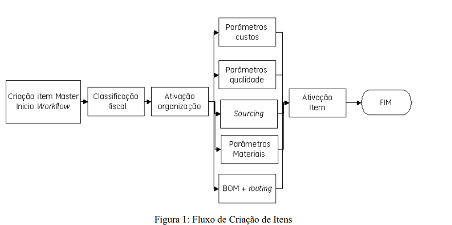

# **Cutover: Implementação de ERP Oracle-EBS**
## O que é um plano de Cutover?

O plano de **Cutover** é uma etapa essencial em projetos de implementação de sistemas ERP (Enterprise Resource Planning), responsável pela transição final entre o sistema antigo e o novo sistema, garantindo que todos os processos e transações da empresa sejam transferidos e executados de forma contínua no novo ambiente. Envolve atividades como migração de dados, testes de sistemas, comunicação com as partes envolvidas e verificação de que o novo sistema está funcionando corretamente. O plano de Cutover visa garantir que a interrupção nas operações seja mínima e que o novo sistema ERP entre em operação de forma eficiente.

## Qual foi o projeto escolhido?

O projeto escolhido foi a implementação de um sistema ERP Oracle-EBS em uma empresa multinacional americana, do setor ferroviário, conhecida como Loco SA. A empresa passou por uma fase de crescimento rápido e, para melhorar o fluxo de dados e integrar suas unidades globais, foi decidido migrar para o sistema ERP Oracle, que já estava parcialmente em uso pela matriz nos Estados Unidos. O projeto envolveu a implantação de diversos módulos do ERP para padronizar e otimizar processos, principalmente na área de Planejamento de Engenharia. O link do artigo pode ser encontrado [aqui](https://abepro.org.br/biblioteca/enegep2010_tn_sto_113_741_16521.pdf).

## Qual o plano e os seus elementos?

O plano de implementação do ERP Oracle-EBS seguiu uma série de etapas, sendo o plano de Cutover uma das mais importantes. Segue descrição dada para essa ação:

"A etapa denominada Cut Over significou a transição do sistema de MRP antigo para o novo sistema de ERP, a fim de que todas as transações da empresa estudada fossem mantidas e que as novas fossem já desenvolvidas no sistema novo, o time do PCP (Planejamento e Controle da Produção) listou todas as ordens de serviço em aberto e as encaminhou para a Engenharia de Planejamento, esta por sua vez criou BOMs reduzidas apenas para a transferência dos custos dos produtos e dos materiais pendentes com o objetivo de equiparar os dados de entrada e saída de um sistema para o outro, durante aproximadamente 5 meses operou-se no Oracle com ordens de trabalho iniciadas no Symix. Sem esta etapa não seria possível apresentar dados verídicos aos órgãos responsáveis por auditorias tributárias e o custo médio do produto ficaria afetado. Em entrevistas com o time de gestores do projeto, verificou-se que o tempo para o cut over antes previsto para 3 dias estende-se até os dias de atuais, segundo os gestores, esta etapa deve ser realizada por caráter de priorização, ou seja primeiro deve-se migrar para o sistema novo apenas os dados a serem utilizados primeiro e depois que passar a fase de implantação migra-se os dados a serem utilizados no futuro"

Além disso algumas informações sobre a implantação geral:

- Tempo: A transição do sistema antigo para o novo foi feita gradualmente durante 5 meses.
- Preço: A implatação foi estimada em U$3.000.000, como é constatado no trecho: "em entrevista com o gerente de TI (Tecnologia da Informação), notou-se um custo de implantação do projeto de ERP stimado em U$3.000.000 (três milhões de dólares)".

## Dificuldades

Uma coisa interessante que o artigo cita, e que já foi discutido outroras em sala de aula, foi a resistência de determinada empresa e os  funcionários quando há uma troca de ERP dentro da empresa, o artigo cita três situalões específicas de isntomas comuns em uma má cooderação do cutover, são eles:

a) os empregados ignoram o sistema: ocorre quando o sistema não resolve as necessidades de determinados grupos de usuários ou quando não são desenvolvidos mecanismos organizacionais (treinamento, remodelamento de funções e responsabilidades, etc.) para assegurar o uso do sistema;
b) baixo moral entre os empregados: pode ocorrer com aqueles que desenvolveram larga experiência na execução de funções que sofrem mudanças (ou até desaparecem) com a implantação de um novo sistema; e
c) resultados desapontadores no uso do sistema, comparados com os esperados quando foi feito o planejamento do sistema.

Para lidar com essa questão, algumas medidas podem ser tomadas, elas foram inclusive discutidas em sala de aula, com a G2 Tecnologia, parceira e cliente do módulo, e nas aulas de modelagem de processos e de Testes e cutover no contexto. Primeiramente é importante mapear todas as necessidades da empresa e entender como melhor servi-las dentro do ERP em questão, no caso do artigo, a Oracle-EBS, segue um mapeamento realizado sobre os macroprocessos da empresa. 

Figura 1 - Fluxo de Criação de Itens

Fonte: Material produzido por Dalton Francisco Pereira e Lauro Soares de Freitas (2010)

Segundamente ter muito bem estabelecido o plano de cutover, afinal não é uma tarefa fácil realizar a migração, e um plano bem elaborado pode permitir que os colaboradores se sintam mais seguros ao realizar o projeto e, por fim, realizar uma comunicação eficiente sobre as entregas do projetos e resultados esperados, evitando expectativas maiores ou mais imediatas do que a realidade.

## Pontos Positivos e Negativos
### Pontos Positivos do Plano:

1. **Integração Global**: O novo sistema ERP permitiu uma melhor integração entre todas as unidades de negócios globais da empresa, facilitando a troca de informações.
2. **Aumento de Eficiência**: O ERP reduziu a redundância de dados e melhorou o fluxo de trabalho nas áreas de planejamento e compras.
3. **Segurança da Informação**: O sistema garantiu uma maior segurança e integridade dos dados da empresa.
4. **Nome do Projeto**: Uma extratégia que eu achei muito interessante foi nomear o projeto internalmente como o "projeto Pegasus", o que fez certa propagando do que estava acontecendo.

### Pontos Negativos do Plano:

1. **Longa Duração da Etapa de Cutover**: O plano de Cutover inicialmente previsto para 3 dias estendeu-se por um período muito maior, afetando o cronograma do projeto.
2. **Falta de Treinamento Adequado**: A deficiência de treinamentos causou dificuldades na transição, com erros de inserção de dados que impactaram o desempenho do novo sistema.
3. **Estresse e Pressão sobre os Funcionários**: A etapa de Go Live foi marcada por estresse e sobrecarga de trabalho, com muitas horas extras, o que afetou negativamente a equipe.

O plano de Cutover é uma etapa fundamental para garantir o sucesso na transição de sistemas ERP, como no caso da implementação do Oracle-EBS na Loco SA. Apesar dos desafios enfrentados, como a extensão do prazo de migração e a necessidade de maior treinamento, o plano resultou em uma melhor integração dos processos globais e maior segurança nos dados. A experiência desse projeto mostra que o sucesso de uma implementação de ERP depende não só da tecnologia, mas principalmente do envolvimento dos colaboradores e de um planejamento detalhado.